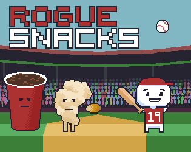

# Rogue Snacks

Available to play at [https://thebenjicat.itch.io/rogue-snacks](https://thebenjicat.itch.io/rogue-snacks).

Survive an endless onslaught of snacks at Vitamin Arena. Build up a fantastic combo. And earn a high score after defeating the rogue snacks.

## MEET YOUR FOES

  Popcorn: Disgraced puffs have a few kernels to throw. 

  Hot dog: Mutated sausages think it’s a WWE ring. 

  Soda: Sparkling tonics want to splash all over you. 

   Churro: Weightless doughnuts fly through the sky.

## CONTROLS

WASD: move (double tap to dash)

ARROWS: Swing your bat

SPACE: Jump

CLICK: Select buttons and cards

## SCORING

Enemy kill: 1 point × combo

Baseball: 10 points × combo

Combo multiplier resets when the timer expires

## CREDITS

Design, Programming, & Art: Benjamin Cates

Audio attributions:

* Baseball calvary sting long sustain.wav by vckhaze -- https://freesound.org/s/380696/ -- License: Creative Commons 0
* MLB Crowd Cheer - 09032022.wav by tylermyers1992 -- https://freesound.org/s/649156/ -- License: Creative Commons 0
* Crowd and field noise before and during homerun hit at MLB baseball stadium by bmadore -- https://freesound.org/s/691975/ -- License: Creative Commons 0
* Soda Can (open, pour, and fizz) by ABStudios -- https://freesound.org/s/177104/ -- License: Attribution 4.0
* Popcorn.aiff by kbay_r -- https://freesound.org/s/541235/ -- License: Creative Commons 0
* Retro video game sfx - Ouch by OwlStorm -- https://freesound.org/s/404747/ -- License: Creative Commons 0
* 8bit-hype-house-drum-loop by RockTrembath -- https://freesound.org/s/722740/ -- License: Creative Commons 0
* baseball-hit-01 by Eelke -- https://freesound.org/s/266642/ -- License: Attribution 4.0

Rogue Snacks was made in 72 hours for [ScoreSpace Jam #36](https://itch.io/jam/scorejam36) (November 2025) with the theme "arena."

Built with [KAPLAY](https://kaplayjs.com), Audacity, and Aseprite.